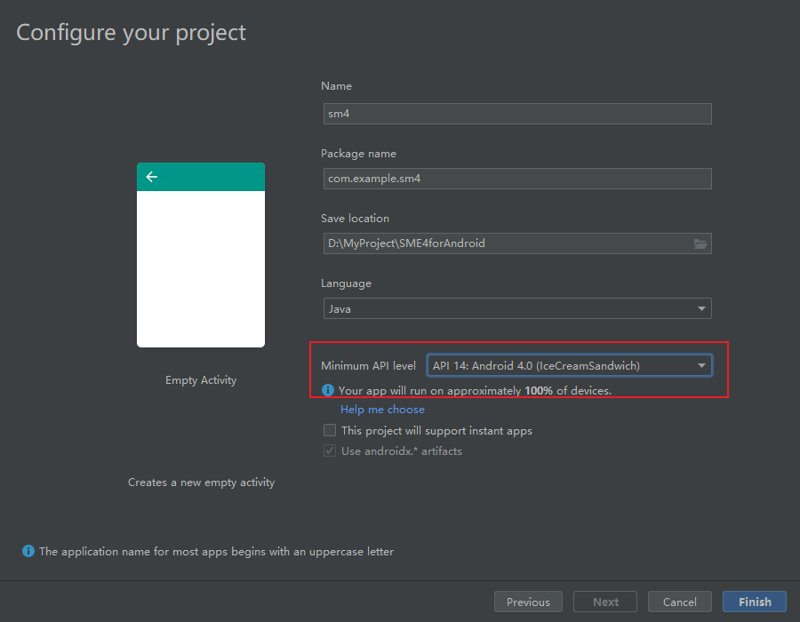
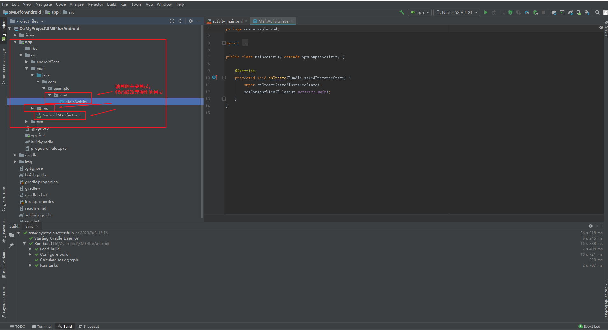
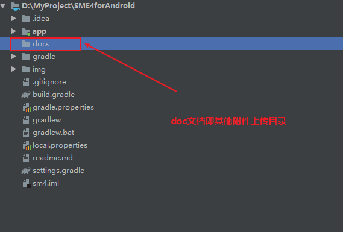
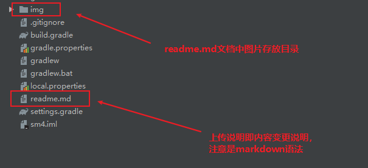

# 说明

## 本文档编辑

[markdown语法](语法.md)

## git仓库使用

[git相关操作](https://song-10.github.io/other/Git%E7%9A%84%E4%BD%BF%E7%94%A8/)

[Android studio 协同开发](https://blog.csdn.net/shurongro/article/details/77387573)

## 项目构建

项目api版本，尽量不要修改版本，jdk等所需包请根据版本下载

项目文件结构，这里需要注意图片中显示的文件树是常见文件风格的，Android studio默认风格是Android的风格

doc文档即其他附件上传目录

readme.md相关说明

## 开发

关于界面源码可参考[第一行代码](https://github.com/guolindev/booksource)

## 日志

+-+-+-+-+-+-+-+-+-+-+-+-+-+-+-+-+-+-+-+-+-+-+-+-+-+-+-+-+-+-+-+-+-+-+-+-+-+-+-+-+-+-+-+-+-+-+-+-+

时间：2020.3.3

说明：project init

上传：nop

+-+-+-+-+-+-+-+-+-+-+-+-+-+-+-+-+-+-+-+-+-+-+-+-+-+-+-+-+-+-+-+-+-+-+-+-+-+-+-+-+-+-+-+-+-+-+-+-+

时间：2020.3.4

说明：项目雏形，注册部分页面并声明软件所需权限；新增页面布局和部分中间逻辑，以及文本加密的接口调用部分

上传：nop

+-+-+-+-+-+-+-+-+-+-+-+-+-+-+-+-+-+-+-+-+-+-+-+-+-+-+-+-+-+-+-+-+-+-+-+-+-+-+-+-+-+-+-+-+-+-+-+-+

时间：2020.3.10

说明：新增短信部分中间逻辑代码及页面（ps：短信模块在模拟器中会崩溃，真机测试正常）

上传：nop

+-+-+-+-+-+-+-+-+-+-+-+-+-+-+-+-+-+-+-+-+-+-+-+-+-+-+-+-+-+-+-+-+-+-+-+-+-+-+-+-+-+-+-+-+-+-+-+-+

时间：2020.3.20

说明： 新增视频及音频部分（ps：音视频选择路径时会失败，需重复选择，才能正常播放）

上传：nop

+-+-+-+-+-+-+-+-+-+-+-+-+-+-+-+-+-+-+-+-+-+-+-+-+-+-+-+-+-+-+-+-+-+-+-+-+-+-+-+-+-+-+-+-+-+-+-+-+

时间：2020.3.27

说明： 新增txt文件加解密（ps：bug没修，会闪退）

上传：nop

+-+-+-+-+-+-+-+-+-+-+-+-+-+-+-+-+-+-+-+-+-+-+-+-+-+-+-+-+-+-+-+-+-+-+-+-+-+-+-+-+-+-+-+-+-+-+-+-+

时间：2020.3.30

说明： 新增sm4加密调用（BC），内容加解密部分完成

上传：nop